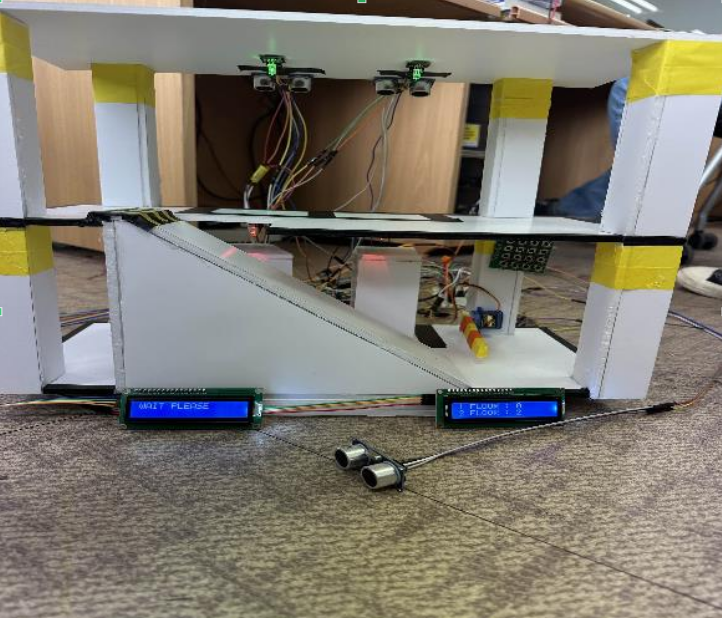

# 🚗 Parking System Project – Basys3 FPGA & Verilog

Basys3 FPGA 보드와 Verilog를 활용하여 구현한 **주차장 제어 시스템**입니다.  
입차 → 주차 → 출차 과정을 자동화하며, 주차 공간 현황과 차량 정보, 입/출차 시간까지 관리하는 시스템입니다.
첨부된 예시 xdc파일에 따라 선을 연결해주시면 됩니다.

<p align="left"> 
  <a href="#-프로젝트-개요">프로젝트 개요</a> • 
  <a href="#-skill-stack">Skill Stack</a> • 
  <a href="#-외관">외관</a> •
  <a href="#-데이터-플로우">데이터 플로우</a> •
  <a href="#-주요-기능">주요 기능</a> • 
  <a href="#-폴더-구조">폴더 구조</a> • 
  <a href="#-trouble-shooting">Trouble Shooting</a> • 
  <a href="#-프로젝트-기여도">프로젝트 기여도</a> •
  <a href="#-시연-영상">시연 영상</a>
</p>

---

## 📌 프로젝트 개요
- **보드/언어**: Basys3 FPGA, Verilog HDL
- **핵심 목표**
  - 실제 주차장 시스템을 FPGA 기반 임베디드 제어로 모사
  - 입차/주차/출차 전 과정 자동화
  - 층별 주차 공간 현황 및 차량 정보 관리 기능 구현
  - 하드웨어 제어와 RTL 설계를 통합하는 경험
 
---

## 🛠 Skill Stack


---

## ✨ 외관



---

## 📊 데이터 플로우


---

## ✨ 주요 기능
- **입차 제어**  
  - 초음파 센서로 차량 감지 후 입차  
  - LCD 안내 메시지 출력  
  - 차량 번호 입력 시 서보 모터 작동 → 차단기 개방
- **주차 관리**  
  - 초음파 센서 + 3색 LED로 주차 공간 상태 표시  
    (빈자리: 초록 / 주차 완료: 빨강)  
  - 주차 완료 시 LCD에 층별 주차 가능 공간 수 갱신
- **출차 제어**  
  - 차량 번호 재입력 시 저장된 정보 확인 → 서보 모터 작동  
  - 출차 시 LCD에 주차 시간 및 요금 표시 후 정보 초기화
- **정보 관리**  
  - 메모리 기반으로 차량 번호와 주차 시간 저장/삭제

---

## 📂 폴더 구조
```
parking_system/
├─ rtl/
│ ├─ top_module.v
│ ├─ lcd_controller.v
│ ├─ servo_controller.v
│ ├─ memory_module.v
│ └─ ...
├─ sim/
│ └─ testbenches.v
├─ docs/
│ └─ flowchart.png
├─ Makefile
└─ README.md
```

---


## 🔧 Trouble Shooting

- **문제 1: Basys3 포트 부족 문제**  
  - Keypad, LCD 등 여러 장치를 동시에 연결 시 포트 수 부족  
  - ✅ 해결: Keypad 모드 전환 버튼을 추가하여 입차/출차 모드 전환 → 자원 재할당

- **문제 2: 출차 LCD 합성 시 시간 Slack 문제**  
  - RTL 합성 시 나눗셈 수식으로 인해 timing violation 발생  
  - ✅ 해결: 분주기 카운터를 새로 설계 → 60초 단위로 분 계산 후 메모리에 저장

- **문제 3: 주차 정보 초기화 문제**  
  - 차량 출차 후에도 메모리에 정보가 남아 재입력 시 오류 발생  
  - ✅ 해결: 출차 시 해당 메모리 주소 데이터 전체를 `0`으로 초기화

---

## 📊 프로젝트 기여도
- 프로젝트 기획  : ███████████████ 100%  
- 코딩         : ███████████████ 100%  
- PPT 제작     : ██████░░░░░░░░░ 20%  
- 하드웨어 제작  : ███░░░░░░░░░░░░ 30%  

---

## 🎥 시연 영상
 
[시연 영상](https://m.youtube.com/shorts/ubf_rlrxye4)
